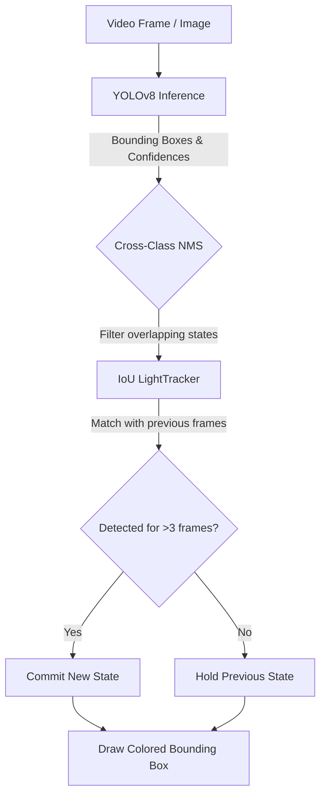
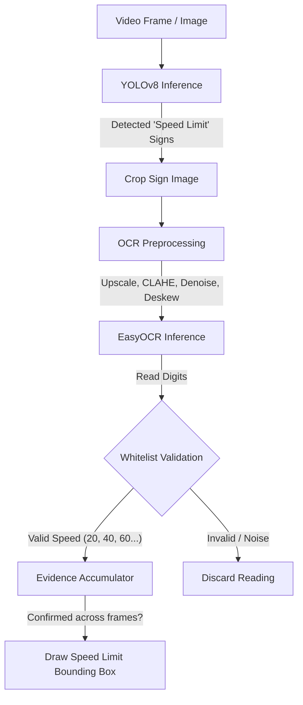
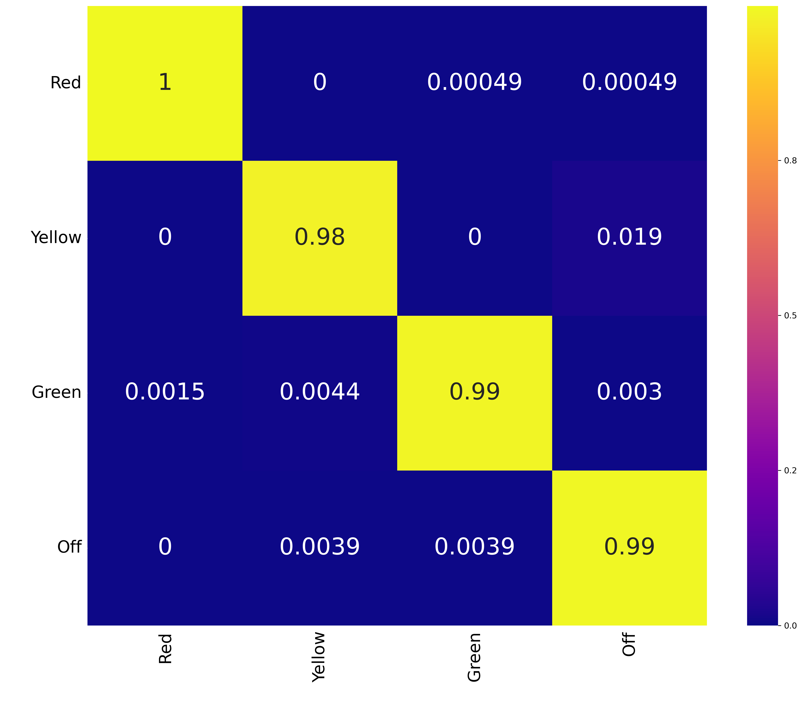
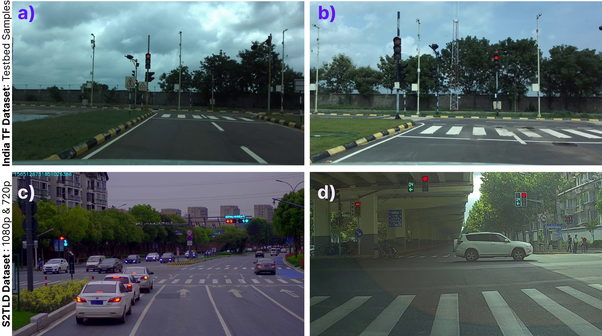
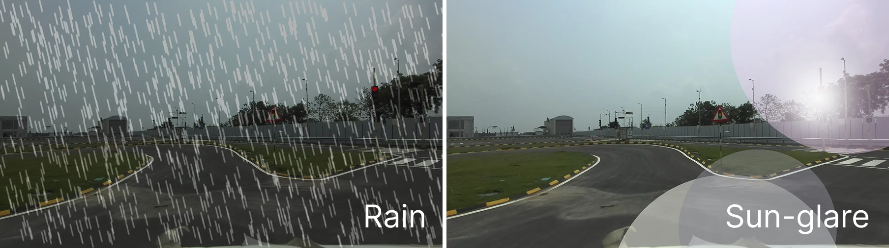
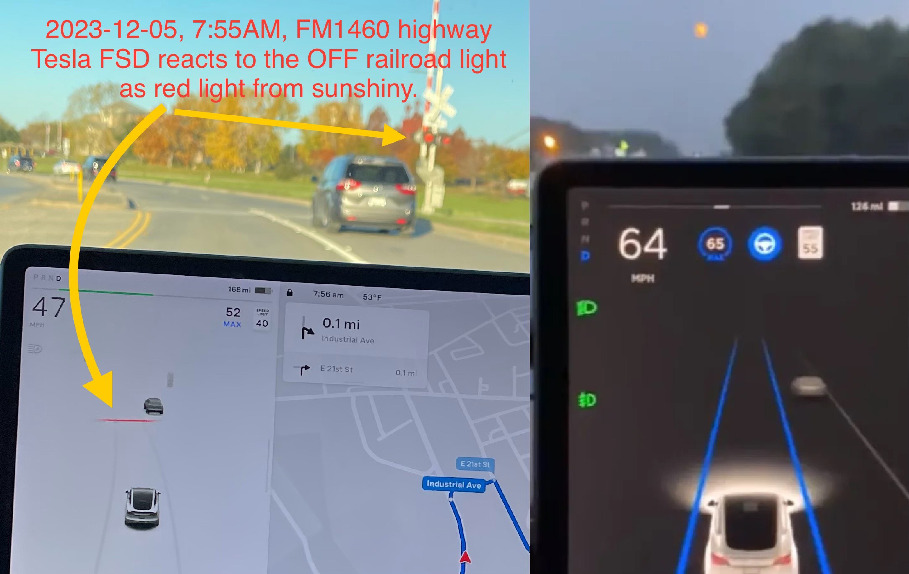
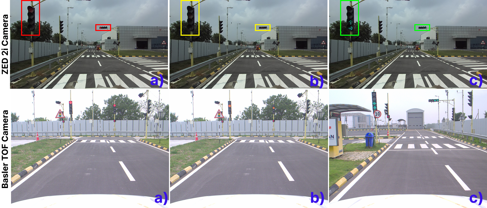
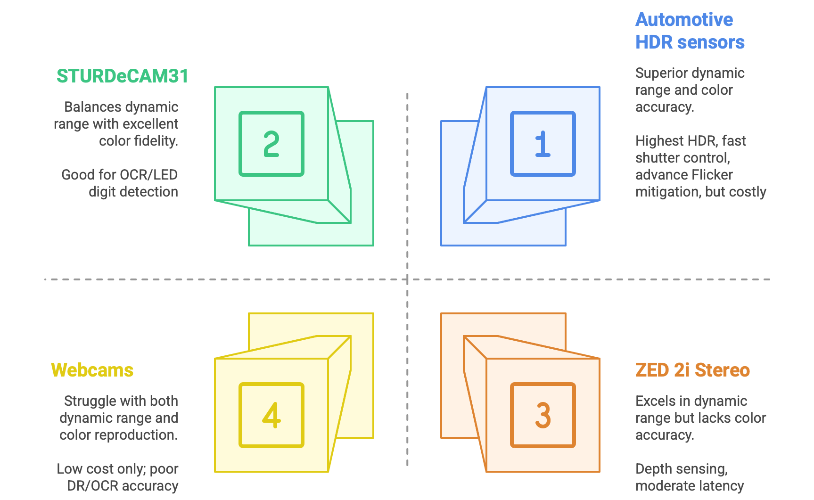

# 🚦 Traffic Light & Sign Detection Pipeline


<div align="center">
  
</div>

---

## 🔬 Tested on S2TLD (Small Traffic Light Dataset)

The pipeline was validated against images from the **S2TLD Dataset** (SJTU), which features real-world urban scenes with small, distant, and heavily occluded traffic lights — one of the hardest benchmarks for traffic light detection.

<div align="center">
  
  <p><i>Animated inference on S2TLD frames. The model correctly identifies light states despite the small pixel footprint and busy urban background.</i></p>
</div>

Real-time and offline detection of traffic light states (Red / Yellow / Green / Off) and traffic sign speed limits (via YOLO + OCR). 

Originally developed as vehicle-testing prototypes coupled to a Basler industrial camera and ROS, this repository is a refined, hardware-agnostic version. It has no ROS or camera-SDK dependencies—the scripts seamlessly accept a **plain image**, a **video file**, or a **webcam index** as input.

---

## 🧠 How It Works (The Pipeline)

### 🚥 Traffic Light Detection Pipeline
Running raw YOLO detection frame-by-frame on video is notoriously jittery. Objects get partially occluded, confidence scores fluctuate, and false positives appear for a split second. This pipeline solves that by implementing an **IoU-based Tracker (`LightTracker`)**.


*The system accumulates "evidence" over time (e.g., 3 consecutive frames) before changing the state of a traffic light, mimicking how a human brain processes continuous video to result in a buttery-smooth output!*

### 🛑 Traffic Sign & OCR Pipeline
This pipeline combines YOLO for sign detection with EasyOCR and intensive preprocessing for reading speed limits.



---

## ✨ Features

### 🚥 Traffic Light Detection (`traffic_light_detection.py`)
- **State Recognition:** YOLO-based 4-class traffic light state detection (Red, Yellow, Green, Off).
- **Cross-Class NMS:** Class-agnostic Non-Maximum Suppression ensures only one state can be reported per physical signal—preventing impossible states (like red and green simultaneously).
- **Temporal Tracking (`LightTracker`):** A lightweight IoU-based tracker provides temporal confirmation drastically reducing single-frame flickering or misclassification.
- **Dynamic Output Saving:** When saving outputs, it automatically creates unique run directories (e.g., `output_name_1`) containing the full `.mp4` video, an `animated .gif` summary, and a `frames/` folder containing every individual annotated frame.

### 🛑 Traffic Sign & Speed Limit OCR (`traffic_sign_speed_detection.py`)
- **Sign Detection & OCR:** YOLO-based traffic sign detection coupled with an EasyOCR pipeline to read speed limit digits.
- **Robust Preprocessing:** Full OCR prep-pipeline including upscaling, CLAHE contrast enhancement, adaptive thresholding, denoising, perspective correction, and deskewing.
- **Real-World Validation:** Whitelist validation against actual legal speed values (e.g., `20/30/40/60/70/80`).
- **Evidence Accumulation:** Speed readings are temporally tracked and only committed once `--min-agree` OCR readings agree across multiple frames. Unconfirmed readings expire after `--expire-frames`.
- **Graceful Degradation:** OCR is entirely optional. If `easyocr` isn't installed, the script falls back to bounding-box sign detection only.

---

## 🛠️ Installation

It is recommended to use a Conda environment to manage dependencies cleanly.

```bash
# 1. Clone the repository
git clone https://github.com/<your-username>/Traffic-Light-And-Sign-Detection.git
cd Traffic-Light-And-Sign-Detection

# 2. Create and activate a Conda environment
conda create -n traffic_light python=3.11
conda activate traffic_light

# 3. Install dependencies
pip install -r requirements.txt
```

---

## 📊 Quantitative Performance & Evaluation

The model was comprehensively benchmarked and evaluated against standard datasets. Below is the quantitative class-wise performance of our traffic light detection model along with comparative models.

### Class-Wise Performance
Our model shows high precision and recall across all major light states.

| Class | Images | Instances | mAP@0.5 | mAP@0.5:0.95 |
| :--- | :---: | :---: | :---: | :---: |
| **Red** | 1200 | 2065 | **0.956** | 0.604 |
| **Yellow** | 137 | 222 | **0.932** | 0.716 |
| **Green** | 773 | 1388 | **0.942** | 0.659 |
| **Off** | 184 | 273 | **0.916** | 0.646 |

### Comparative Model Benchmarks
Our custom detection pipeline significantly outperforms classic architectures:

| Model | mAP@0.5 | Precision | Recall | F1-Score |
| :--- | :---: | :---: | :---: | :---: |
| Faster R-CNN | 82.3% | 79.1% | 73.6% | 76.3% |
| RetinaNet | 85.7% | 81.4% | 78.9% | 80.1% |
| YOLOv4 | 89.2% | 84.6% | 82.3% | 83.4% |
| **Our Model** | **95.88%** | **94.53%** | **96.09%** | **93.96%** |

<div align="center">
  
  
  <p><i>Left: Validation Confusion Matrix. Right: Training Dataset Sample Layout.</i></p>
</div>

---

## 🔬 Qualitative Analysis of Detection Performance

### Success Cases
The model demonstrates robust performance under challenging conditions such as **heavy rain** and **partial occlusions**. It accurately detects traffic signals even when they are partially obscured or degraded. Additionally, a notable issue observed in previous model versions—misclassifying vehicle tail lights (brake lights) as active red signals—has been resolved in this iteration.

<div align="center">
  
  <p><i>Inference under heavy rain, glare, and occlusion. Notice the complete elimination of tail-light false positives.</i></p>
</div>

### Persistent Failure Modes

1. **Sensor Limitations in Consumer-Grade Hardware:**
   Webcams and low-dynamic-range (LDR) sensors ($\leq$70 dB DR) frequently overexpose traffic lights under high-lux daylight conditions ($\geq$100,000 lux), creating false glow artifacts. This leads to an **18% misclassification rate** of off-state signals as active.
   
2. **Spectral Confusion in High-Contrast Scenarios (Solar Interference):**
   Low sun angles (15°–30°) during dawn or dusk create lens flares that obscure **64%** of visible signals in 8-bit RGB images. HDR sensors with 120+ dB DR reduce this error to **26%** by preserving overexposed gradient information. This challenge is also a documented issue faced by Tesla FSD vehicles under reflective lighting.

<div align="center">
  
  <p><i>Failure cases under glare/reflection. Left: Tesla FSD misinterpreting a reflective OFF railroad signal as active red. Right: A full moon interpreted as a traffic signal.</i></p>
</div>

3. **Color Degradation Artifacts:**
   - **Lens Contamination:** Dusty enclosures reduce contrast between red and green from 1.8:1 to 1.2:1, contributing to **9%** of classification errors.
   - **LED Aging:** In coastal regions, yellow LED luminance decays by **7.2% per year**, shifting chromaticity into the off-state cluster within 18 months.

---

## 📷 Camera Selection & Hardware Analysis

Based on hardware testing, different sensor characteristics drastically affect overall performance:

- **Automotive HDR Cameras:** Offer the best performance under all lighting conditions with superior reliability—ideal for safety-critical systems.
- **e-con STURDeCAM31:** Strikes a strong balance between HDR fidelity (120dB) and integration cost, especially for embedded ADAS prototypes.
- **ZED 2i:** Good for depth-based tasks, but is unreliable for traffic light OCR under glare or low-light.
- **Webcams:** Should be avoided for outdoor traffic analysis due to major HDR and fidelity limitations.

<div align="center">
  
  <p><i>Comparison of Red, Yellow, and Green Traffic Light perception across different cameras (e.g. ZED 2i vs Basler).</i></p>
</div>

<div align="center">
  
  <p><i>Camera selection trade-offs (Dynamic Range, Lux sensitivity, vs cost).</i></p>
</div>

---

## 🏗️ Repository Structure

```text
Traffic-Light-And-Sign-Detection/
├── traffic_light_detection.py       # Traffic light state detection (YOLO + Tracker)
├── traffic_sign_speed_detection.py  # Traffic sign & speed limit OCR pipeline
├── evaluate_s2tld.py                # Evaluation script for S2TLD benchmark
├── albumentation-train.py           # Augmentation training helper
├── requirements.txt
├── README.md
├── LICENSE
├── assets/                          # Demo GIFs and images used in README
│   ├── basler_demo.gif
│   ├── s2tld_demo.gif
│   ├── tesla.jpg
│   ├── rain-glare.png
│   ├── camera-comparsinon.png
│   ├── camera_selection.png
│   ├── confusion_matrix_traffic_light_val.png
│   └── TF_dataset.jpg
├── data/                            # Sample input images/videos (not in repo)
└── weights/                         # Trained .pt model weights (not in repo)
```

---

## 📄 License

This project is licensed under the MIT License - see the `LICENSE` file for details.
