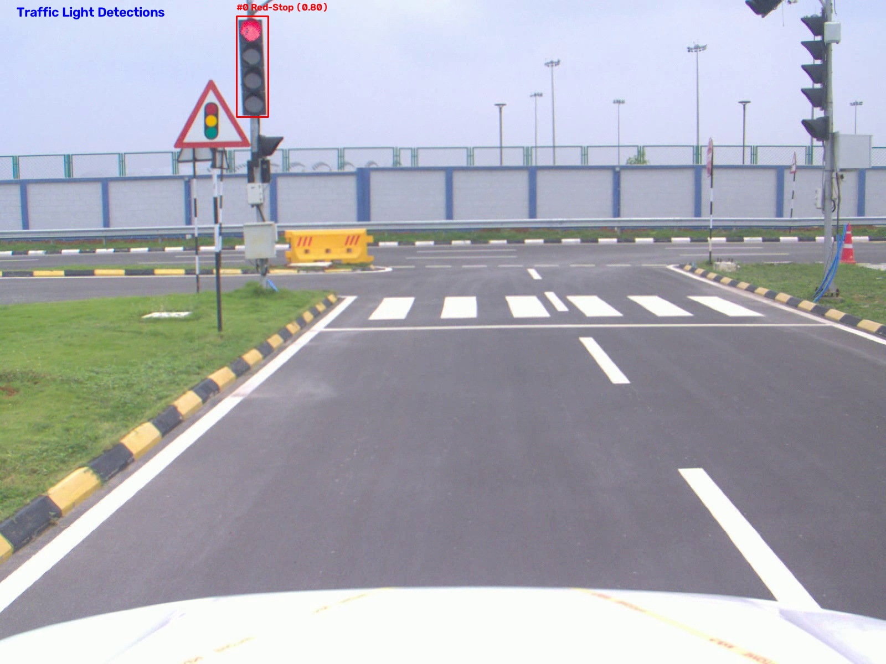

# 🚦 Traffic Light & Sign Detection Pipeline


<div align="center">
  
</div>

Real-time and offline detection of traffic light states (Red / Yellow / Green / Off) and traffic sign speed limits (via YOLO + OCR). 

Originally developed as vehicle-testing prototypes coupled to a Basler industrial camera and ROS, this repository is a refined, hardware-agnostic version. It has no ROS or camera-SDK dependencies—the scripts seamlessly accept a **plain image**, a **video file**, or a **webcam index** as input.

---

## ✨ Features

### 🚥 Traffic Light Detection (`traffic_light_detection.py`)
- **State Recognition:** YOLO-based 4-class traffic light state detection (Red, Yellow, Green, Off).
- **Cross-Class NMS:** Class-agnostic Non-Maximum Suppression ensures only one state can be reported per physical signal—preventing impossible states (like red and green simultaneously).
- **Temporal Tracking (`LightTracker`):** A lightweight IoU-based tracker provides temporal confirmation. A light's displayed state only changes after it holds for `--confirm-frames` consecutive frames, drastically reducing single-frame flickering or misclassification.
- **Dynamic Output Saving:** When saving outputs, it automatically creates unique run directories (e.g., `output_name_1`) containing the full `.mp4` video, an `animated .gif` summary, and a `frames/` folder containing every individual annotated frame.

### 🛑 Traffic Sign & Speed Limit OCR (`traffic_sign_speed_detection.py`)
- **Sign Detection & OCR:** YOLO-based traffic sign detection coupled with an EasyOCR pipeline to read speed limit digits.
- **Robust Preprocessing:** Full OCR prep-pipeline including upscaling, CLAHE contrast enhancement, adaptive thresholding, denoising, perspective correction, and deskewing.
- **Real-World Validation:** Whitelist validation against actual legal speed values (e.g., `20/30/40/60/70/80`).
- **Evidence Accumulation:** Speed readings are temporally tracked and only committed once `--min-agree` OCR readings agree across multiple frames. Unconfirmed readings expire after `--expire-frames`.
- **Graceful Degradation:** OCR is entirely optional. If `easyocr` isn't installed, the script falls back to bounding-box sign detection only.

---

## 🛠️ Installation

It is recommended to use a Conda environment to manage dependencies cleanly.

```bash
# 1. Clone the repository
git clone https://github.com/<your-username>/Traffic-Light-And-Sign-Detection.git
cd Traffic-Light-And-Sign-Detection

# 2. Create and activate a Conda environment
conda create -n traffic_light python=3.11
conda activate traffic_light

# 3. Install dependencies
pip install -r requirements.txt
```

### 🧠 Model Weights Setup
Place your trained YOLO weights (`.pt` files) in the `models/` directory or a `weights/` directory:
- `traffic_light.pt` — 4-class traffic light model.
- `traffic_sign.pt` — Traffic sign model (must include a `speed limit-m` class).

*(Note: Model weights are not committed to this repo due to size constraints. Distribute them via GitHub Releases or Git LFS).*

---

## 🚀 Usage

### 🚦 Traffic Light Detection

```bash
# Single image (Default Resolution is 832, Conf is 0.50)
python traffic_light_detection.py --source examples/frame.jpg --model weights/traffic_light.pt --show

# Video file, save annotated output (Creates a unique folder with video, frames, and a GIF)
python traffic_light_detection.py --source examples/drive.mp4 --model weights/traffic_light.pt --save output_light

# Live Webcam
python traffic_light_detection.py --source 0 --model weights/traffic_light.pt --show
```

### 🛑 Traffic Sign / Speed-Limit OCR

```bash
# Single image
python traffic_sign_speed_detection.py --source examples/frame.jpg --sign-model weights/traffic_sign.pt --show

# Video file, save annotated output
python traffic_sign_speed_detection.py --source examples/drive.mp4 --sign-model weights/traffic_sign.pt --save output_sign
```

### ⚙️ Key CLI Arguments (Both Scripts)
- `--conf`: Detection confidence threshold (Default: `0.50`). Lower this if you want to detect partially occluded lights, but beware of false positives!
- `--imgsz`: Inference resolution (Default: `832`).
- `--device`: Target compute device (`cpu`, `0` for CUDA, etc.).
- `--save`: Base name/path for the output directory.
- `--show`: Display the live annotated output in an OpenCV window.
- `--confirm-frames`: (Traffic Light) Consecutive frames a state must persist before acceptance (Default: `3`).
- `--min-agree`, `--expire-frames`, `--no-ocr`: (Traffic Sign) Fine-tuning for the OCR evidence accumulation.

---

## 🏗️ Repository Structure

```text
Traffic-Light-And-Sign-Detection/
├── traffic_light_detection.py       # Main script for traffic lights
├── traffic_sign_speed_detection.py  # Main script for traffic signs
├── requirements.txt
├── README.md
├── changes.md                       # Internal changelog
├── data/                            # Sample input images/videos
└── weights/                         # Directory for your trained .pt weights
```

---

## 🔬 Design Notes: Why Temporal Tracking?
Running raw YOLO detection frame-by-frame on video is notoriously jittery. Objects get partially occluded, confidence scores fluctuate, and false positives appear for a split second. 

This repository solves that by implementing an **IoU-based Tracker (`LightTracker`)**. Instead of trusting a single frame, the system remembers where bounding boxes were in previous frames. It accumulates "evidence" over time (e.g., 3 consecutive frames) before changing the state of a traffic light or committing to a speed limit reading. This mimics how a human brain processes continuous video, resulting in a buttery-smooth output!

---

## 📄 License

This project is licensed under the MIT License - see the `LICENSE` file for details.
